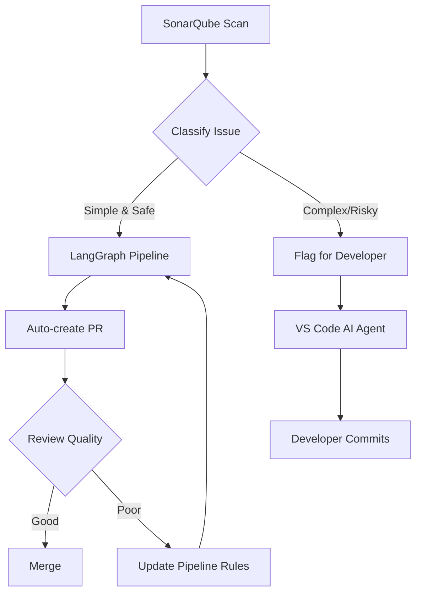

# ReActAgentSonarFixLangGraph
Great question! Let me give you an **honest comparison** of both approaches:

## 🥊 **VS Code AI Agent vs LangGraph Pipeline**

### **VS Code AI Agent (Copilot/Cursor/etc.)**

**✅ Strengths:**
- **Full context awareness**: Sees your entire workspace, open files, git history
- **Interactive & iterative**: Developer can guide, refine, and course-correct in real-time
- **Better for complex issues**: Can ask clarifying questions, understand business logic
- **IDE integration**: Works within your natural workflow
- **Immediate feedback**: Developer validates each fix before committing
- **Understands nuance**: "Fix this but preserve the error handling pattern"

**❌ Weaknesses:**
- **Requires developer time**: Someone has to sit there and process each issue
- **Doesn't scale**: Can only fix as fast as a human can review
- **Manual trigger**: Developer has to actively engage with each issue
- **Inconsistent**: Quality depends on how well developer prompts the AI
- **No automation**: Can't run overnight or continuously

---

### **LangGraph Automated Pipeline**

**✅ Strengths:**
- **Scales massively**: Can process 100+ issues while you sleep
- **Consistent approach**: Same analysis pattern for every issue
- **Zero developer time**: Runs autonomously, devs only review PRs
- **Continuous operation**: Can monitor and fix new issues as they appear
- **Metrics & tracking**: Built-in success rates, categories, trends
- **Batch processing**: Fix all "unused imports" across 50 files in one go
- **Can integrate multiple tools**: SonarQube + tests + linting + security scans

**❌ Weaknesses:**
- **Limited context**: May not understand broader architectural decisions
- **Can't ask questions**: If ambiguous, has to make assumptions or skip
- **Initial setup complexity**: More engineering effort to build and maintain
- **Potentially over-aggressive**: Might create noise with low-quality PRs
- **Less nuanced**: May miss edge cases that humans would catch
- **Debugging**: When it fails, harder to understand why

---

## 🎯 **Which Approach When?**

| Scenario | Best Approach | Why |
|----------|---------------|-----|
| **Security vulnerabilities** | VS Code AI Agent | Needs human judgment, understanding of attack vectors |
| **100+ code smells** | LangGraph Pipeline | Scales better, consistent fixes |
| **Complex business logic bugs** | VS Code AI Agent | Requires understanding of requirements |
| **Unused imports, deprecations** | LangGraph Pipeline | Mechanical, safe, repetitive |
| **New codebase** (learning) | VS Code AI Agent | Interactive exploration helps understanding |
| **Mature codebase** (maintenance) | LangGraph Pipeline | Ongoing automated cleanup |
| **Critical production code** | VS Code AI Agent | Human oversight at every step |
| **Internal tools, prototypes** | LangGraph Pipeline | Speed > perfection |
| **One-time cleanup** | LangGraph Pipeline | Bulk fix, review later |
| **Ongoing development** | VS Code AI Agent | Integrated into natural workflow |

---

## 💡 **Hybrid Approach (Best of Both Worlds)**



**Implementation:**
1. **LangGraph handles**: Unused imports, simple null checks, formatting, deprecated APIs
2. **VS Code Agent handles**: Security issues, complex logic, performance problems, architectural changes
3. **Pipeline learns**: Track which types of auto-fixes get rejected → remove from auto-fix list

---

## 🏆 **My Recommendation:**

**Start with LangGraph for:**
- Code smells (SonarQube's "Code Smell" severity)
- Minor bugs that are mechanical (unused variables, etc.)
- Issues with confidence > 80%

**Use VS Code AI for:**
- Security vulnerabilities
- Major bugs affecting business logic
- Issues the pipeline failed to fix
- Anything human-flagged as "needs context"

**Example Rule Set:**
```python
AUTO_FIX_RULES = {
    "java:S1481": "auto",  # Unused local variables → LangGraph
    "java:S1172": "auto",  # Unused method parameters → LangGraph
    "java:S2259": "manual",  # Null pointer → VS Code (logic-dependent)
    "java:S3776": "manual",  # Cognitive complexity → VS Code (refactoring)
    "java:SQL2077": "manual",  # SQL injection → VS Code (security)
}
```

---

## 📊 **Expected Results:**

**LangGraph Pipeline:**
- Handles ~40-60% of SonarQube issues
- 80%+ auto-fix success rate (if tuned well)
- Saves ~10-15 hours/week for a team

**VS Code AI Agent:**
- Handles the remaining 40-60%
- Higher quality fixes (human-guided)
- Still faster than manual fixes (30-50% time savings)

---

**Bottom line:** Your LangGraph approach is **excellent for scale and automation**, but you should **reserve complex/risky issues for human developers using AI assistants**. The combination is more powerful than either alone.

Want me to help you design the classification logic to decide which issues go to which approach?
Still faster than manual fixes (30-50% time savings)


Bottom line: Your LangGraph approach is excellent for scale and automation, but you should reserve complex/risky issues for human developers using AI assistants. The combination is more powerful than either alone.
Want me to help you design the classification logic to decide which issues go to which approach?RetryClaude can make mistakes. Please double-check responses.
